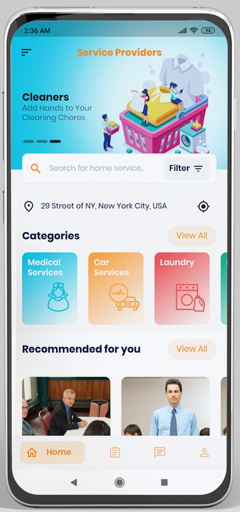
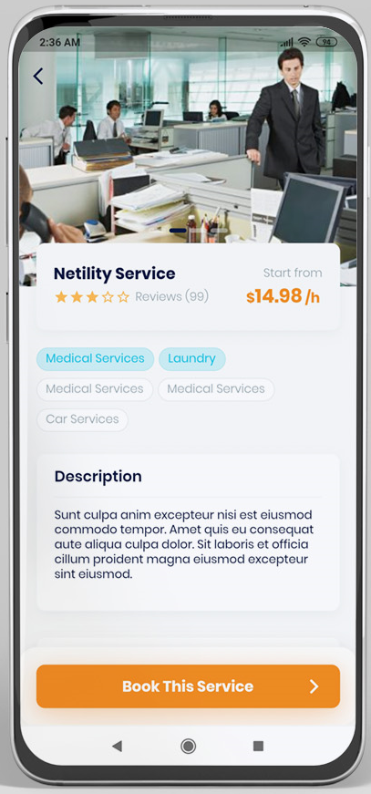
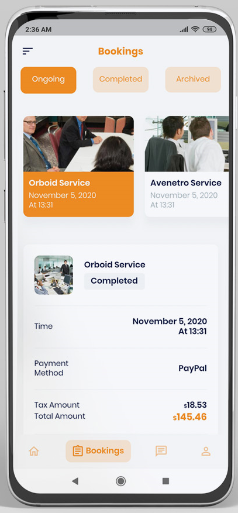
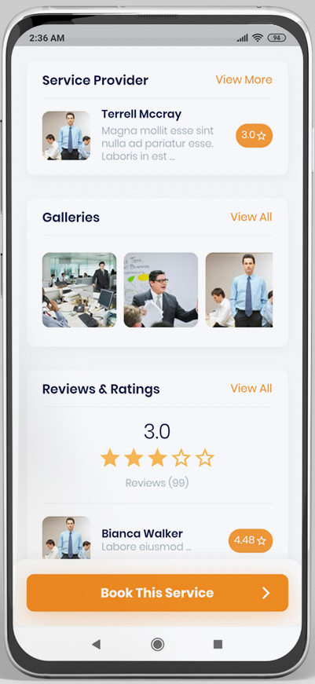
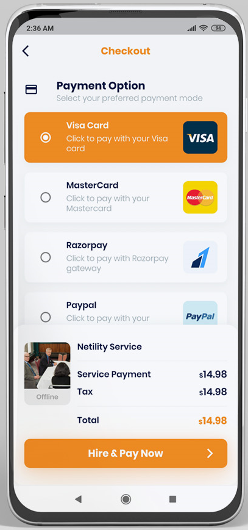
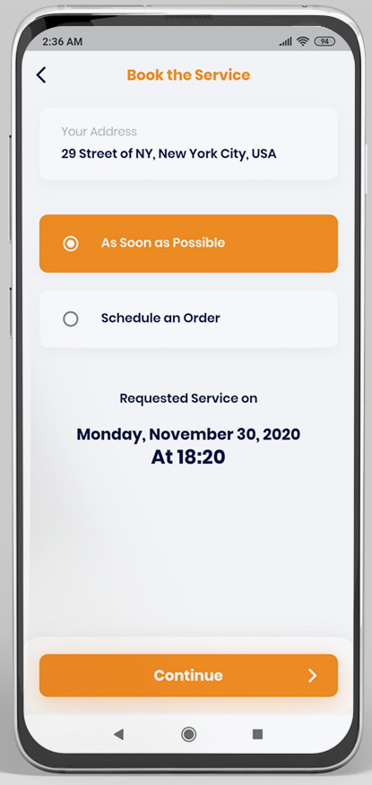

# HomeService-Customer-Flutter

### Introduction

The mobile app developed using a flutter framework created by Google is open-source mobile application development. It is used to develop applications for Android and iOS, as well as being the primary method of creating applications

### Requirements

To edit this project you must have Flutter and Dart installed and configured successfully on your device Install flutter
Set up your editor Install the Flutter and Dart plugins

### Get Started

1- Go to GitHub Releases and download the last release 

2- Unzip the flutter_application folder, use your preferred IDE (Android Studio / Visual Code / IntelliJ) to open the project.

3 - Open /config/global.json and edit the remote link to connect your mobile app with your admin panel

{
  ...
  "laravel_base_url": "http://yourdomain.com/public/",
  ...
}

## Screenshot

|                Screenshot               |                 Screenshot            |               Screenshot              |
|:---------------------------------------:|:-------------------------------------:|:-------------------------------------:|
|    |      |    |

|                Screenshot               |                 Screenshot            |               Screenshot              |
|:---------------------------------------:|:-------------------------------------:|:-------------------------------------:|
|    |      |    |
